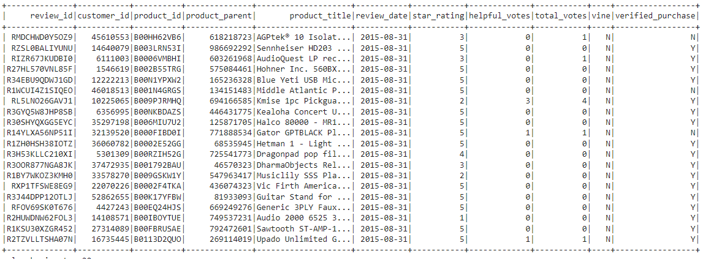
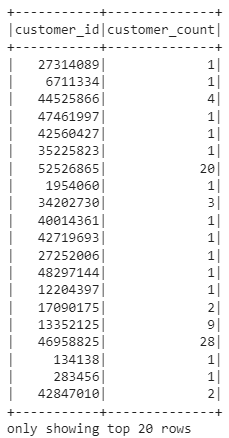
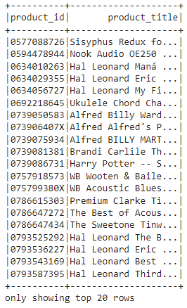
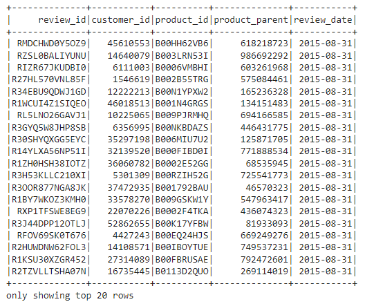
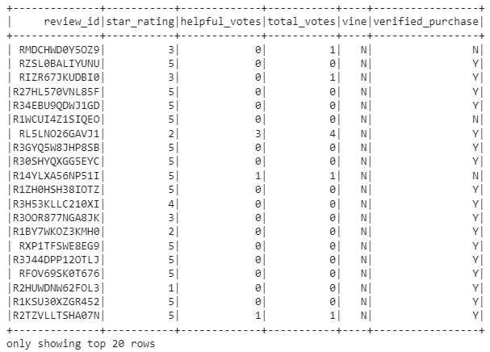
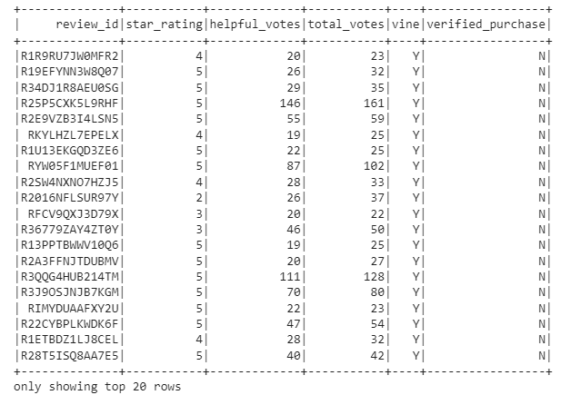
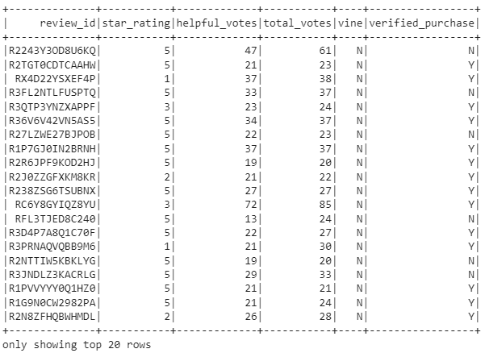
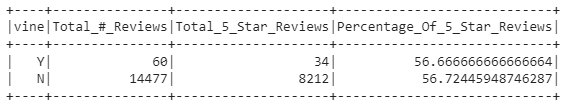

# Amazon_Vine_Analysis
## Overview
In this analysis, we were asked to choose 1 data set from a list of 50 data sets of Amazon reviews. We were asked to extract the data, transform the data, and then load the data to a AWS RDS that was connected to pgAdmin. Finally, we were asked to examine the data in order to see if the Amazon Vine Program (paid reviews) affects the tone of the review.

I chose the Musical Instrument dataset. I began by extracting the data via PySpark, and quickly eliminated columns that would not be useful for our analysis. The result was the below DataFrame, which I named review_df.

I then began to construct the required DataFrames referenced in the SQL schema, of which there were four: customers_df, products_df, review_id_df, and vine_df.

### Customers DataFrame

### Products DataFrame

### Review ID DataFrame

### Vine DataFrame

These DataFrames were then loaded to pgAdmin. After loading, I performed queries to make sure the data was imported correctly.

## Results
In a new Google Colab notebook, I again extracted the data using PySpark, and rebuilt the vine_df table that we did previously. I then filtered the vine_df to show only reviews that had 20 or more votes, as shown below.

 reviews only and non-Vine (unpaid) reviews only. Those dataframes are listed below, respectively.

Lastly, I assembled a analytical DataFrame to determine the total amount of reviews, the total number of 5 star reviews, and the percentage of 5 star reviews vs. total reviews.

### How many Vine reviews and non-Vine reviews were there?
There were 60 Vine reviews and 14,477 non-Vine reviews.

### How many Vine reviews were 5 stars? How many non-Vine reviews were 5 stars?
There were 34 5-star Vine reviews and 8,212 5-star non-Vine reviews.

### What percentage of Vine reviews were 5 stars? What percentage of non-Vine reviews were 5 stars?
56.67% of Vine reviews were 5-star, vs. 56.72% of 5-star non-Vine reviews.

## Summary

Given the data above, there is absolutely no bias whether or not a review is paid. This is interesting, as one would think that a paid review would be more likely to be positive. However, the percentage of 5 star reviews between the two classifications are nearly identical.

I would recommend analyzing further datasets to see if this trend is the same across different categories. Musical Instruments are a pretty specific subset of what Amazon sells, so analyzing all 50 datasets provided would give a much better representation of whether or not a paid review is biased.
